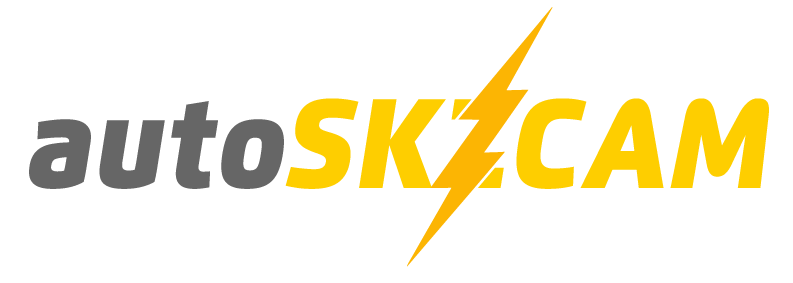

# Home

`autoSKZCAM` is a computational framework for performing accurate yet efficient predictions of ionic surfaces.

- `autoSKZCAM` is highly flexible, currently supporting two popular quantum chemistry codes: [MRCC](https://mrcc.hu/) and [ORCA](https://orcaforum.kofo.mpg.de/), combining an arbitrary number electrostatic and mechanical embedding [ONIOM](https://pubs.acs.org/doi/10.1021/cr5004419) layers.

- `autoSKZCAM` is powered by [QuAcc](https://github.com/Quantum-Accelerators/quacc) and provides pre-made surface chemistry workflows that can be efficiently dispatched (and restarted) anywhere: locally, HPC, the cloud, or any combination thereof.

---

